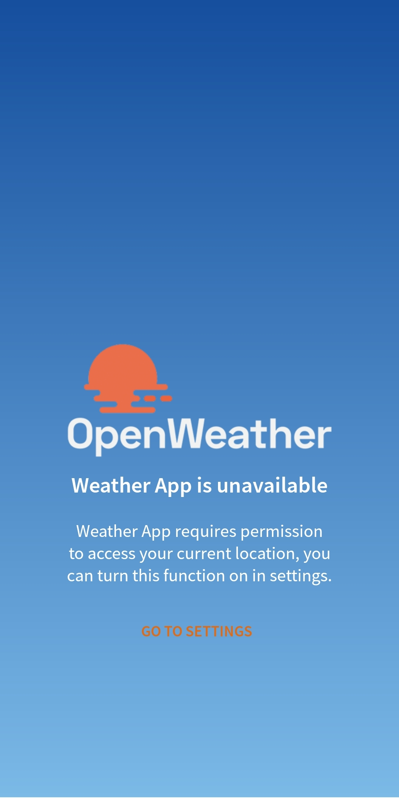

# Global Kinetic - Weather App

## Table of content
- [Project description](#project-description)
- [Screenshots](#screenshots)
- [Used technologies](#used-technologies)
- [Project structure](#project-structure)
- [Pre-installation](#pre-installation)
- [Download apk](#download-apk)

## Project description
It's a Weather app written in Kotlin.
The app displays the current weather at the user’s location and a 5-day forecast.
With 3 hourly graph and Map with current location marker that have current location information

## Screenshots
### App icon:  
  
### Splash icon:  
  
  
  
### Main screen:  
   
### Error message screen:  
   

## Used technologies
#### Libraries:
- <a href="https://weeklycoding.com/mpandroidchart/">MPAndroidChart</a>
- <a href="https://square.github.io/retrofit/">Retrofit2</a>
- <a href="https://developers.google.com/maps/documentation/android-sdk/start">Google Maps</a>

#### List of APIs
- [openweathermap.org](https://openweathermap.org/current) for getting current weather data based on the user’s current location.
- [openweathermap.org](https://openweathermap.org/forecast5) for getting a 5-day forecast based on the user’s current location.

## The project description
#### Splash screen page:
- Request access to the user’s location upon app launch. 
- Custom dialog 
#### Main page:
- Connect to the Weather API and lookup the weather conditions for the current location. 
- Display the current weather at the user’s location and a 5-day forecast. 
- A loader should be shown to the user while they are waiting 
- Any location or network errors handled and shown to the user. 
- Allows you to click on the day and get more details. 
- Allows you to view a 3 hourly temperature graph with Rain percentage and humidity percentage. 
- Allows you to open map with marker of your current location. 
- Allows you to click on the marker and see location details with temperature. 

#### Error Page page:
- Allows you to access to app settings

## Project architecture
- Using MVVM (Model view ViewModel)

## Design Patterns
- Factory (Match interfaces of different classes)
- Singleton (A class of which only a single instance can exist )

## Project structure
- com.forestdesign
    - applicationmanger - files containing constants or any files that related to app configurations.
    - backend - a package that has all backend components related to call APIs
    - handler - have all the handlers, utilities, exceptions & helpers.
    - model - models needed for project
        - models for all the projects (weather, forecast).
    - view - files used for user interface (ui).
        - activities - all activities for project
        - adapter - adapters and viewholders for recycler views.

## Pre-installation
* Use Android Studio latest version 2022.3.1 Patch 4
* Works with android API 24 up to the latest official release
* Written in Kotlin

## Download apk
<a href="https://github.com/MelDiSooQi/gk-weather-app/raw/main/app/release/app-release.apk" target="_blank">DOWNLOAD APK</a>  
<a href="app/release/app-release.apk" target="_blank">DOWNLOAD APK</a>
